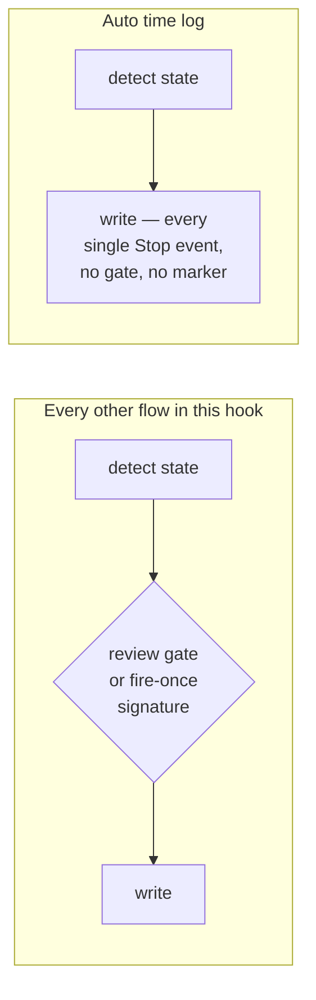
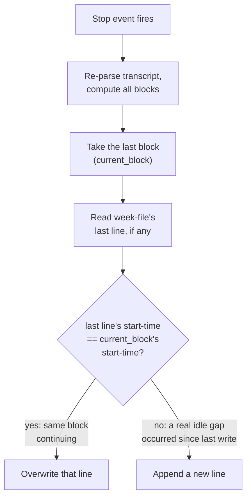

# Auto Time Log

Automatically computes Eva's current work block on every Stop event and
writes it directly to the current week's log file — no review gate, by
deliberate design, unlike every other flow in this hook.

Related: reuses the Stop hook's stdin-reading of `transcript_path`
(already extracted for other purposes — see [[flow-3a-commits-to-linear]]).
Shares nothing with [[workflow-stage-advancement]]'s gap-detection
machinery — this is a different kind of write entirely (unconditional,
every turn, no persisted "already handled" marker), not another gap.

## Why this exists

Flow 3a has referenced a "matching time-log line" since v1 — the
computation behind it was never built. Today, time logging is entirely
manual: a standalone script (`time_tracker.py`) parses a session
transcript after the fact, and Eva hand-transcribes the result into a
growing txt file. This capability closes that gap for real, and
generalizes the mechanism so any colleague's project can use it.

## The write is unconditional — and that's intentional

Flows 3a/3b/3c wait for Eva's review before writing anything to Linear or
a file. The workflow-stage gaps write once per fired signature and never
touch it again. This capability does neither — it writes on *every* Stop
event, potentially dozens of times per work session, upserting the same
line over and over. That's correct: a work-block timestamp is an
objective fact ("Eva was interacting with Claude during this window"),
not a judgment call the way "should this become a Linear ticket" is —
there's nothing for a review step to protect against.

## Upsert: comparing start-times, not tracking an "is this open" flag

No block is ever known to have "truly ended" until a real 20-minute idle
gap appears after it — there's no other signal available. Comparing
start-times instead of tracking a separate open/closed flag needs no
extra persisted state and is self-correcting: if a write is ever missed
for any reason, the next write's comparison still behaves correctly on
its own.

## Weekly boundary: Friday 00:00 local time, decided by a block's start

A block belongs to whichever week contains its *start* time — never
split across two files, even if it runs past the boundary. Local time,
not UTC, because the boundary should reflect Eva's actual work week, and
the transcript's raw timestamps are UTC.

**A corrected claim, caught during grilling.** The first draft of this
decision argued "a block crossing midnight is short, so the
mis-attribution risk is small" — that's wrong. The 20-minute gap cutoff
bounds the *gaps between* timestamps inside a block, not the block's
total duration. A late-night push before a deadline could run for hours
across the boundary with no single pause long enough to split it, and
the whole thing still files under the week it started in. That's an
accepted trade-off (splitting a block across two files would meaningfully
complicate the upsert logic above, for a genuinely rare case) — not a
small one, and it's documented honestly here instead of behind the
original false claim.

## A field that got cut during grilling

The first draft added a second config field, `timetable_file_prefix`, so
filenames could read `ironman-time-log-2026-09-05_2026-09-11.txt` instead
of just `2026-09-05_2026-09-11.txt`. Grilled: directory and prefix never
vary independently in any realistic setup — nobody configures the same
directory with two different prefixes, or the same prefix across two
directories. A second field just doubles setup effort for flexibility
nobody uses; the directory's own name already carries the "what is this"
context. Dropped. One field — `timetable_dir` — is enough.

## What isn't handled

- **Concurrent sessions.** Two Claude Code sessions in the same repo at
  once would both try to upsert the same week file's last line. Out of
  scope — Eva's actual usage pattern is one session per repo at a time;
  revisit with a real design pass if this ever becomes a real problem,
  not a speculative fix bolted on now.
- **Hand-edits to the open line.** If Eva manually corrects a duration
  on a week file's last line while that line is still "open" (being
  upserted), the next Stop event silently overwrites her edit — the
  algorithm can't distinguish "the tool wrote this" from "a human wrote
  this" without adding a marker, which isn't worth the complexity right
  now. The rule instead: **the last line of any week file is
  auto-maintained and can be overwritten at any time** — only edit a
  line once a newer block has started and it's no longer the file's last
  line.
- **Backfill.** Logging only starts from whenever a repo opts in, same
  "no automatic backfill" policy every other flow already follows.

## Crash safety

Writes go through a temp-file-then-rename pattern
(write full new content to a sibling temp file, then `os.replace()` it
over the target) rather than in-place line editing — a crash or kill
mid-write can never leave the week file partially written; the old
version survives intact until the new one is fully ready to replace it.
