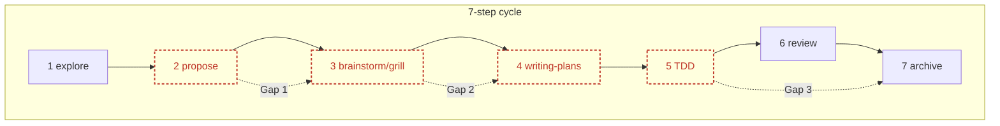
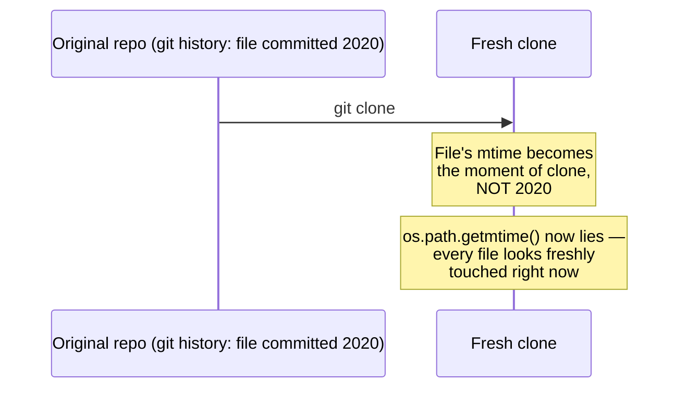
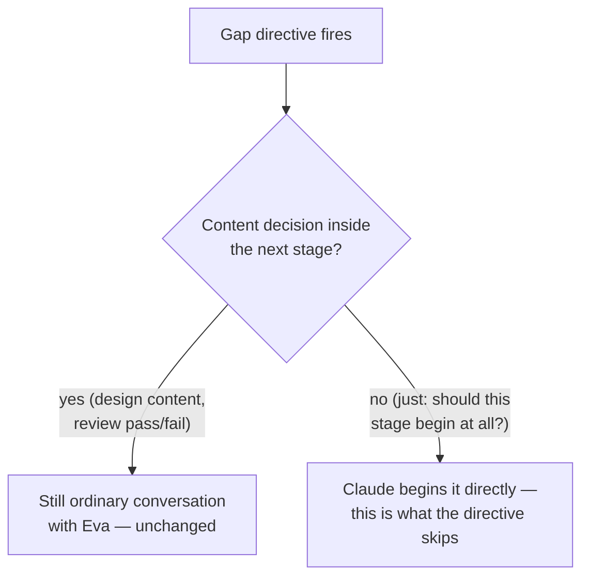

# Workflow Stage Advancement

Detects stalls between adjacent stages of the 7-step per-change
development cycle (explore → propose → brainstorm/grill → writing-plans
→ TDD → review → archive), and directs Claude to begin the next stage —
without waiting for a "should I start?" confirmation, since the 7-step
sequence itself is a standing agreement, not a per-instance decision.

Related: [[flow-3b-openspec-to-linear]] and [[flow-3c-artifact-reminder]]
detect adjacent OpenSpec state and share the same underlying query layer
([[openspec-check-module]]); this capability's *directive* phrasing
(instruct-not-propose) follows the same pattern established by
`context_usage_handoff.py` elsewhere in this session's work — a decision
worth its own note if that mechanism ever gets pulled into synclinear
proper.

## Why this exists

Before this capability, the 7-step cycle only existed as prose in
`DESIGN.md` — background Claude doesn't read proactively. Every new
project meant re-explaining the sequence by hand. Flows 3a/3b/3c already
prove the pattern of "detect state, act on it via the Stop hook" works
for syncing Linear; this capability applies the same mechanism to the
development cycle's own internal handoffs.

## The three gaps

Each gap looks at a *pair* of artifacts, not a global "current step"
counter — half the stages (explore, mid-brainstorm, review) leave no
reliable disk trace to hang a state machine on, so a cursor would
constantly go stale. Instead:

| Gap | Fires when | Doesn't fire when |
|---|---|---|
| **1** | An OpenSpec change's `tasks` artifact exists (`status != "no-tasks"`) but nothing under `docs/` has a commit time at or after the change's `lastModified` | A `docs/` file (however named — no filename convention assumed) postdates the change |
| **2** | Something under `docs/` postdates everything in `docs/superpowers/plans/` | A plan file postdates the newest design doc |
| **3** | An OpenSpec change's `tasks.md` is fully checked (`status == "complete"`) | The change has already been archived — confirmed empirically that `openspec list --json` drops archived changes entirely, so "still in the list" already means "not archived," no extra check needed |

## Why timestamps, not filename matching

An earlier version of Gap 1/2 tried to derive the expected `docs/`
filename from the OpenSpec change's kebab-case name. Rejected: this
repo's own `docs/` convention (independent feature → own folder,
single-parent sub-feature → subfolder, graph-shaped dependency →
wikilink, this document included) doesn't guarantee a design doc's
filename echoes the change name at all. Comparing *timestamps* sidesteps
naming entirely — if anything under `docs/` is fresh enough, the gap
doesn't fire, regardless of what it's called.

## A real bug found and fixed before this shipped

The first version of the timestamp comparison used `os.path.getmtime()`
— plain filesystem mtime. Grilled during design, and verified with a real
`git clone` round-trip:

Since colleagues will `git clone` their own copies of any repo using this
capability, this isn't an edge case — it's the very first thing that
happens on every fresh checkout. Fixed by preferring `git log -1
--format=%ct -- <path>` (the file's real last-commit time from history)
over filesystem mtime, falling back to mtime only for a file that isn't
tracked/committed yet (which, not having been cloned, can't have had its
timestamp corrupted the same way).

## Directive phrasing, and why it's not a review-gate violation

Flows 3a/3b/3c always phrase their findings as proposals: "here's what I
found — read SKILL.md and follow it," which walks into a review-gated
flow requiring Eva's go-ahead before anything is written. Gap directives
are worded differently — "Gap 1 detected for change `<name>` — begin the
brainstorm/grill stage now" — because **advancing to the next stage of an
already-agreed 7-step cycle isn't the kind of decision the review-gate
exists to protect.** The review-gate exists for content decisions with
real consequences (should this get a Linear ticket, does this commit
close a ticket) — not for "should I start the next agreed-upon phase of
work."

This distinction matters, so it's worth stating plainly what a directive
does *not* skip:

## Judgment before acting (grilled and revised)

Three scenarios surfaced during grilling where literally always acting
immediately on a directive would misfire — none change *what* is
detected, only how SKILL.md instructs Claude to *respond*:

1. **Directive fires mid-unrelated-work.** Eva's mid-conversation on
   something the triggering change has nothing to do with. Claude
   mentions the pending gap briefly and defers, rather than derailing
   what's actually happening.
2. **Eva wants to redo an already-"advanced" stage.** A gap signature,
   once recorded, never re-fires on its own — deleting a design doc to
   rewrite it leaves the mechanism silently inert with no obvious sign
   anything's wrong. Claude proactively clears the relevant signature the
   moment Eva mentions redoing that stage, rather than leaving her to
   notice and ask.
3. **Gap 3's "review" signal is really just checkbox state.** `tasks.md`
   gets checked off by Claude during TDD — that's a fact about
   implementation completeness, not proof Eva has reviewed anything. If
   review already happened earlier in the same conversation (Eva said
   "looks good" right before the last box got checked), re-presenting the
   work for review on the next Stop event is a pointless repeat. Claude
   checks first, and skips straight to "review's done — archive now?"
   when that's the case.

## Persistence

One new config field, `advanced_workflow_gaps: list[str]`, entries shaped
like `"<change-name>:gap1"` (Gap 2's signature has no change name — it's
repo-wide, so it's the fixed literal `"docs:gap2"`). Same shape and same
accepted trade-off as the existing `known_openspec_changes`: append-only,
never pruned automatically — a stale entry is harmless, and the
alternative (an entry that gets removed then silently reappears) risks
mistaking "already handled" work for brand new. The one deliberate
backstop against staleness is the manual-clear behavior in the judgment
section above — not automatic expiry.
